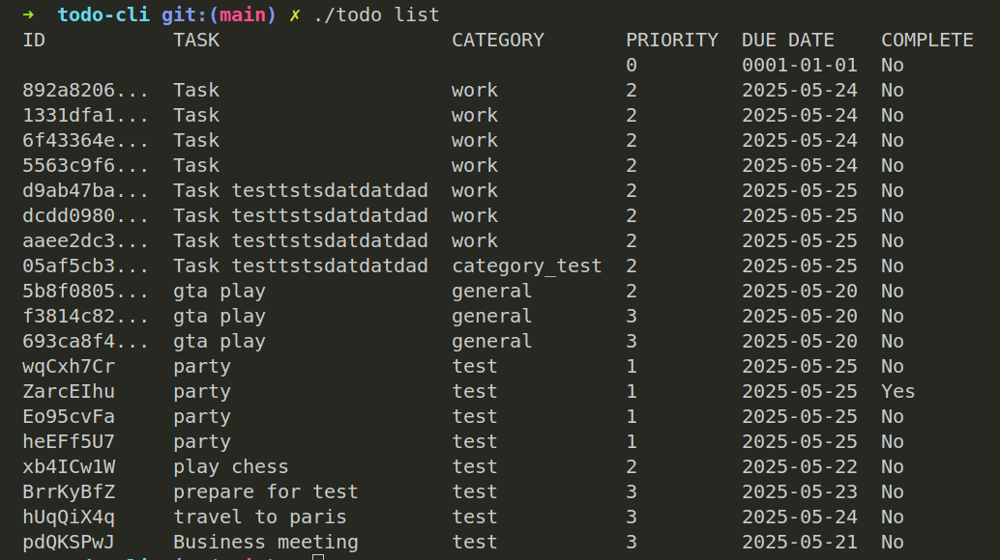

# Todo CLI 📝

[](https://golang.org/)
[](LICENSE)

A feature-rich command line todo manager written in Go that stores tasks in Excel format (.xlsx).



## Features ✨

- ✅ Add, list, complete, and delete tasks
- 📅 Due dates and priority levels
- 📊 Excel file storage (easy to view/edit in spreadsheet apps)
- 🔍 Filter by category/priority
- 🖥️ Colorful terminal output
- 📦 Single binary with no dependencies

## Installation ⚡

### From Source

```bash
# Clone the repository
git clone https://github.com/yourusername/todo-cli.git
cd todo-cli

# Build and install
go build -o todo cmd/todo/main.go
sudo mv todo /usr/local/bin/
```

## Basic Usage 🛠️

### Add task

```sh
./todo add "Buy milk" -c shopping -p 2 -d 2023-12-31
```

### List tasks

```sh
./todo list
```

### Complete task

```sh
./todo complete <task-id>
```

### Delete task

```sh
./todo delete <task-id>
```
